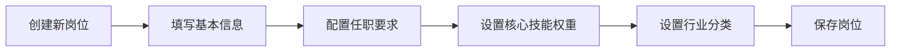

## 1. 产品概述

招聘顾问简历诊断 Web 应用，帮助招聘顾问批量评估候选人与岗位的匹配度，提升招聘效率和精准度。通过智能简历解析、自动匹配分析和模板化推荐，将传统人工评估流程数字化、智能化。

- **核心价值**：将招聘顾问从繁琐的简历筛选中解放出来，专注于高价值的候选人沟通和面试环节
- **目标用户**：企业 HR、猎头顾问、招聘专员
- **解决痛点**：简历筛选效率低、评估标准不统一、推荐报告不规范、候选人状态跟踪混乱

## 2. 核心功能

### 2.1 用户角色

| 角色 | 注册方式 | 核心权限 |
|------|----------|----------|
| 招聘顾问 | 账号登录 | 简历上传、岗位管理、匹配分析、报告导出、状态跟踪、模板管理 |

### 2.2 功能模块

1. **候选人列表**：简历批量上传、候选人信息展示、行业筛选、状态管理、顾问备注
2. **岗位库**：岗位信息维护、任职要求配置、技能要求管理、行业分类
3. **匹配报告**：智能匹配度计算、缺失经历分析、面试追问生成、匹配评分可视化
4. **沟通记录**：沟通历史记录、推荐理由保存、跟进提醒
5. **模板管理**：客户推荐模板配置、模板预览、导出候选人简报

### 2.3 页面详情

| 页面名称 | 模块名称 | 功能描述 |
|---------|---------|----------|
| 候选人列表 | 批量上传模块 | 拖拽/点击上传多份简历，自动解析提取基本信息、工作年限、核心技能 |
| 候选人列表 | 筛选过滤模块 | 按行业、学历、工作年限、匹配状态筛选候选人 |
| 候选人列表 | 列表展示模块 | 卡片式展示候选人信息，显示匹配分、当前状态、最新备注 |
| 候选人列表 | 状态管理模块 | 标记候选人状态：待评估、已推荐、面试中、已录用、已淘汰 |
| 岗位库 | 岗位列表模块 | 展示所有岗位，支持新增、编辑、删除岗位 |
| 岗位库 | 岗位编辑模块 | 配置岗位名称、行业、薪资范围、任职要求、技能要求 |
| 匹配报告 | 匹配度分析模块 | 展示候选人与目标岗位的匹配得分、维度雷达图、分项评分 |
| 匹配报告 | 缺失经历模块 | 智能识别候选人缺少的关键经历和技能 |
| 匹配报告 | 面试追问模块 | 根据缺失点自动生成针对性的面试问题 |
| 沟通记录 | 备注管理模块 | 为候选人添加顾问备注、保存推荐理由 |
| 沟通记录 | 历史记录模块 | 展示所有沟通历史，按时间线排列 |
| 模板管理 | 模板列表模块 | 管理不同客户的推荐模板 |
| 模板管理 | 模板编辑模块 | 富文本编辑模板内容，支持变量占位符 |
| 模板管理 | 导出模块 | 套用模板生成候选人推荐简报，支持 PDF/Word 导出 |

## 3. 核心流程

### 3.1 简历批量评估流程

招聘顾问上传多份简历，系统自动解析提取信息，与目标岗位进行智能匹配，生成匹配报告，顾问根据报告决定是否推荐。

```mermaid
flowchart LR
    A["批量上传简历"] --> B["智能解析提取"]
    B --> C["自动识别工作年限/技能"]
    C --> D["选择目标岗位"]
    D --> E["计算匹配度得分"]
    E --> F["生成匹配报告"]
    F --> G["查看缺失经历"]
    G --> H["生成面试追问点"]
    H --> I["添加顾问备注"]
    I --> J["标记候选人状态"]
    J --> K["套用推荐模板"]
    K --> L["导出候选人简报"]
```

### 3.2 岗位配置流程

## 4. 用户界面设计

### 4.1 设计风格

**专业精致风** - 专为招聘顾问打造的企业级工具

- **主色调**：深海蓝 `#1e3a5f` - 代表专业、可信赖、稳重
- **辅助色**：
  - 翠绿 `#10b981` - 表示匹配度高、已录用
  - 琥珀橙 `#f59e0b` - 表示面试中、待跟进
  - 玫红 `#ef4444` - 表示已淘汰、低匹配
  - 浅蓝 `#3b82f6` - 表示已推荐
- **中性色**：以石板灰 `#f1f5f9` 为底色，深灰 `#334155` 为主要文字色
- **字体**：
  - 标题：`Noto Serif SC` - 精致衬线字体，提升专业感
  - 正文：`Noto Sans SC` - 清晰易读的无衬线字体
- **按钮风格**：直角边框、细边框、轻微阴影，悬停时背景色加深
- **布局风格**：左侧导航 + 右侧内容区的经典企业级布局，卡片式模块，优雅留白
- **图标风格**：使用 `lucide-react` 线性图标，统一 20px 尺寸

### 4.2 视觉细节

- **背景**：主区域采用纯白，侧边导航使用深色渐变，增加层次感
- **卡片**：细微阴影 `0 1px 3px rgba(0,0,0,0.08)`，圆角 4px，边框 1px 浅灰色
- **数据可视化**：匹配度使用进度条和圆环图展示，雷达图展示多维度匹配
- **动画**：页面加载时内容区域从下往上淡入，卡片悬停时轻微上浮 + 阴影加深
- **专业元素**：匹配分使用大号数字展示，颜色根据分数区间变化

### 4.2 页面设计概览

| 页面名称 | 模块名称 | UI 元素 |
|---------|---------|----------|
| 候选人列表 | 顶部操作栏 | 搜索框、行业筛选下拉、批量上传按钮、状态筛选标签 |
| 候选人列表 | 候选人卡片 | 头像、姓名、行业标签、工作年限、匹配分圆环、状态徽章、最新备注预览 |
| 候选人列表 | 上传区域 | 拖拽上传区，支持 PDF/Word/文本格式，上传进度条 |
| 岗位库 | 岗位卡片 | 岗位名称、行业标签、薪资范围、所需技能标签、匹配候选人数 |
| 匹配报告 | 评分概览 | 大号匹配分数、等级评定、匹配维度雷达图 |
| 匹配报告 | 缺失经历 | 红色警示图标、缺失项列表、影响程度说明 |
| 匹配报告 | 面试追问 | 问题卡片、分类标签、可复制按钮 |
| 沟通记录 | 时间线 | 垂直时间线、沟通内容卡片、操作人、时间戳 |
| 模板管理 | 模板卡片 | 模板名称、适用客户、预览缩略图、编辑/删除操作 |
| 模板管理 | 编辑器 | 富文本编辑区、变量插入面板、实时预览区 |

### 4.3 响应式设计

- **桌面优先**：以 1440px 宽度为基准设计，左侧导航 240px 固定宽度
- **平板适配**：1024px 以下，导航栏可折叠为图标模式
- **移动端**：768px 以下，导航变为底部 Tab 栏，卡片改为单列布局
- **触摸优化**：按钮最小点击区域 44x44px，重要操作增加触觉反馈动画

### 4.4 微交互设计

- **匹配度计算**：数字从 0 滚动到最终得分，进度条同步填充
- **状态变更**：状态徽章颜色渐变过渡，伴随轻微缩放动画
- **上传进度**：文件上传时显示动态进度条和文件名
- **筛选切换**：筛选条件变化时，卡片优雅地重新排列并淡入淡出
