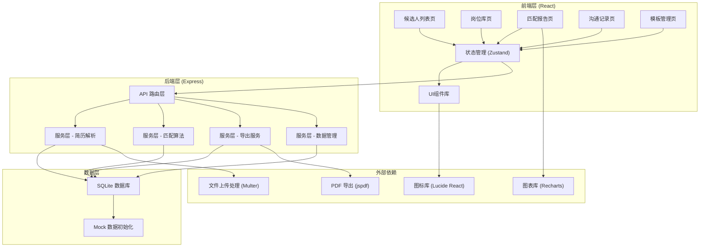
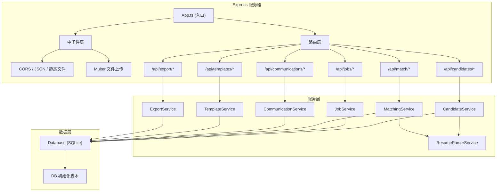
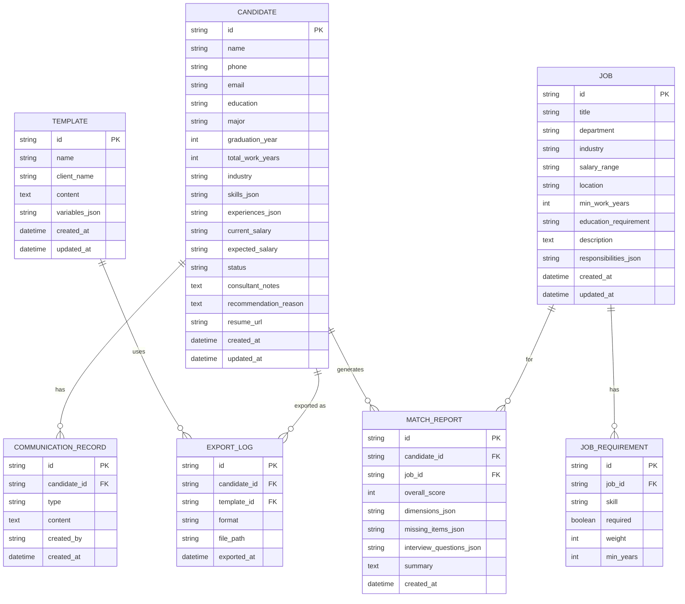

## 1. 架构设计



## 2. 技术描述

### 2.1 技术栈选型

| 层级 | 技术选型 | 版本 | 说明 |
|------|----------|------|------|
| 前端框架 | React | 18.x | 组件化开发，高效渲染 |
| 语言 | TypeScript | 5.x | 类型安全，提升开发质量 |
| 构建工具 | Vite | 5.x | 快速开发构建 |
| 状态管理 | Zustand | 4.x | 轻量级状态管理 |
| 路由 | React Router DOM | 6.x | 单页应用路由 |
| UI 样式 | Tailwind CSS | 3.x | 原子化 CSS 框架 |
| 图表 | Recharts | 2.x | React 图表库，用于雷达图、进度条 |
| 图标 | Lucide React | 0.344.x | 高质量线性图标 |
| 后端框架 | Express | 4.x | 轻量级 Node.js 框架 |
| 数据库 | SQLite | 3.x | 轻量级关系型数据库，无需单独部署 |
| ORM | better-sqlite3 | 11.x | 高性能 SQLite 驱动 |
| 文件上传 | Multer | 1.4.x | 处理文件上传 |
| PDF 导出 | jspdf | 2.5.x | 生成 PDF 报告 |

### 2.2 项目初始化

- **模板**: `react-express-ts` - React + TypeScript + Express 全栈模板
- **包管理器**: npm
- **项目结构**:
  ```
  .
  ├── src/                 # 前端源码
  │   ├── components/      # 通用组件
  │   ├── pages/           # 页面组件
  │   ├── hooks/           # 自定义 Hooks
  │   ├── utils/           # 工具函数
  │   ├── store/           # Zustand 状态管理
  │   └── types/           # TypeScript 类型定义
  ├── api/                 # 后端源码
  │   ├── routes/          # API 路由
  │   ├── services/        # 业务逻辑服务
  │   ├── db/              # 数据库操作
  │   └── types/           # 后端类型定义
  ├── shared/              # 前后端共享类型
  └── migrations/          # 数据库迁移脚本
  ```

## 3. 路由定义

### 3.1 前端路由

| 路由路径 | 页面名称 | 说明 |
|---------|---------|------|
| `/` | 候选人列表 | 首页，展示候选人列表、上传入口 |
| `/candidates` | 候选人列表 | 同上，列表页主路由 |
| `/candidates/:id` | 候选人详情 | 单个候选人的详细信息和匹配报告 |
| `/jobs` | 岗位库 | 岗位列表和管理 |
| `/jobs/:id` | 岗位详情 | 岗位编辑和匹配候选人列表 |
| `/match/:candidateId/:jobId` | 匹配报告 | 候选人与岗位的详细匹配分析 |
| `/communications` | 沟通记录 | 所有候选人的沟通历史 |
| `/templates` | 模板管理 | 推荐模板列表和编辑 |

### 3.2 后端 API 路由

| 方法 | 路径 | 功能 |
|------|------|------|
| GET | `/api/candidates` | 获取候选人列表，支持筛选 |
| GET | `/api/candidates/:id` | 获取候选人详情 |
| POST | `/api/candidates/upload` | 批量上传简历文件 |
| PUT | `/api/candidates/:id` | 更新候选人信息和状态 |
| DELETE | `/api/candidates/:id` | 删除候选人 |
| POST | `/api/candidates/:id/notes` | 添加候选人备注 |
| GET | `/api/jobs` | 获取岗位列表 |
| GET | `/api/jobs/:id` | 获取岗位详情 |
| POST | `/api/jobs` | 创建新岗位 |
| PUT | `/api/jobs/:id` | 更新岗位信息 |
| DELETE | `/api/jobs/:id` | 删除岗位 |
| GET | `/api/match/:candidateId/:jobId` | 获取匹配分析报告 |
| POST | `/api/match/batch` | 批量计算匹配度 |
| GET | `/api/communications` | 获取沟通记录列表 |
| GET | `/api/communications/:candidateId` | 获取单个候选人沟通记录 |
| POST | `/api/communications` | 添加沟通记录 |
| GET | `/api/templates` | 获取模板列表 |
| GET | `/api/templates/:id` | 获取模板详情 |
| POST | `/api/templates` | 创建新模板 |
| PUT | `/api/templates/:id` | 更新模板 |
| DELETE | `/api/templates/:id` | 删除模板 |
| POST | `/api/export/briefing` | 导出候选人简报 |

## 4. API 定义

### 4.1 核心数据类型定义

```typescript
// shared/types.ts

export type CandidateStatus = 
  | 'pending'      // 待评估
  | 'recommended'  // 已推荐
  | 'interview'    // 面试中
  | 'hired'        // 已录用
  | 'rejected';    // 已淘汰

export interface Skill {
  name: string;
  level: 'beginner' | 'intermediate' | 'advanced' | 'expert';
  years: number;
}

export interface Experience {
  company: string;
  position: string;
  startDate: string;
  endDate: string;
  description: string;
}

export interface Candidate {
  id: string;
  name: string;
  phone: string;
  email: string;
  education: string;
  major: string;
  graduationYear: number;
  totalWorkYears: number;
  industry: string;
  skills: Skill[];
  experiences: Experience[];
  currentSalary: string;
  expectedSalary: string;
  status: CandidateStatus;
  consultantNotes: string;
  recommendationReason: string;
  resumeUrl: string;
  createdAt: string;
  updatedAt: string;
}

export interface JobRequirement {
  skill: string;
  required: boolean;
  weight: number;
  minYears?: number;
}

export interface Job {
  id: string;
  title: string;
  department: string;
  industry: string;
  salaryRange: string;
  location: string;
  minWorkYears: number;
  educationRequirement: string;
  requirements: JobRequirement[];
  responsibilities: string[];
  description: string;
  createdAt: string;
  updatedAt: string;
}

export interface MatchDimension {
  name: string;
  score: number;
  maxScore: number;
  description: string;
}

export interface MissingItem {
  type: 'skill' | 'experience' | 'education';
  name: string;
  impact: 'high' | 'medium' | 'low';
  description: string;
}

export interface InterviewQuestion {
  category: string;
  question: string;
  purpose: string;
}

export interface MatchReport {
  candidateId: string;
  jobId: string;
  overallScore: number;
  dimensions: MatchDimension[];
  missingItems: MissingItem[];
  interviewQuestions: InterviewQuestion[];
  summary: string;
  createdAt: string;
}

export interface CommunicationRecord {
  id: string;
  candidateId: string;
  type: 'note' | 'call' | 'email' | 'interview';
  content: string;
  createdBy: string;
  createdAt: string;
}

export interface Template {
  id: string;
  name: string;
  clientName: string;
  content: string;
  variables: string[];
  createdAt: string;
  updatedAt: string;
}
```

### 4.2 响应格式

```typescript
interface ApiResponse<T> {
  success: boolean;
  data?: T;
  error?: string;
  message?: string;
}

interface PagedResponse<T> {
  success: boolean;
  data: T[];
  total: number;
  page: number;
  pageSize: number;
}
```

## 5. 服务器架构图



## 6. 数据模型

### 6.1 ER 图



### 6.2 数据库初始化脚本

```sql
-- migrations/001_init.sql

CREATE TABLE IF NOT EXISTS candidates (
  id TEXT PRIMARY KEY,
  name TEXT NOT NULL,
  phone TEXT,
  email TEXT,
  education TEXT,
  major TEXT,
  graduation_year INTEGER,
  total_work_years INTEGER DEFAULT 0,
  industry TEXT,
  skills_json TEXT,
  experiences_json TEXT,
  current_salary TEXT,
  expected_salary TEXT,
  status TEXT DEFAULT 'pending',
  consultant_notes TEXT,
  recommendation_reason TEXT,
  resume_url TEXT,
  created_at DATETIME DEFAULT CURRENT_TIMESTAMP,
  updated_at DATETIME DEFAULT CURRENT_TIMESTAMP
);

CREATE TABLE IF NOT EXISTS jobs (
  id TEXT PRIMARY KEY,
  title TEXT NOT NULL,
  department TEXT,
  industry TEXT,
  salary_range TEXT,
  location TEXT,
  min_work_years INTEGER DEFAULT 0,
  education_requirement TEXT,
  description TEXT,
  responsibilities_json TEXT,
  created_at DATETIME DEFAULT CURRENT_TIMESTAMP,
  updated_at DATETIME DEFAULT CURRENT_TIMESTAMP
);

CREATE TABLE IF NOT EXISTS job_requirements (
  id TEXT PRIMARY KEY,
  job_id TEXT NOT NULL,
  skill TEXT NOT NULL,
  required BOOLEAN DEFAULT 1,
  weight INTEGER DEFAULT 10,
  min_years INTEGER,
  FOREIGN KEY (job_id) REFERENCES jobs(id) ON DELETE CASCADE
);

CREATE TABLE IF NOT EXISTS match_reports (
  id TEXT PRIMARY KEY,
  candidate_id TEXT NOT NULL,
  job_id TEXT NOT NULL,
  overall_score INTEGER NOT NULL,
  dimensions_json TEXT,
  missing_items_json TEXT,
  interview_questions_json TEXT,
  summary TEXT,
  created_at DATETIME DEFAULT CURRENT_TIMESTAMP,
  FOREIGN KEY (candidate_id) REFERENCES candidates(id) ON DELETE CASCADE,
  FOREIGN KEY (job_id) REFERENCES jobs(id) ON DELETE CASCADE
);

CREATE TABLE IF NOT EXISTS communications (
  id TEXT PRIMARY KEY,
  candidate_id TEXT NOT NULL,
  type TEXT NOT NULL,
  content TEXT NOT NULL,
  created_by TEXT DEFAULT 'system',
  created_at DATETIME DEFAULT CURRENT_TIMESTAMP,
  FOREIGN KEY (candidate_id) REFERENCES candidates(id) ON DELETE CASCADE
);

CREATE TABLE IF NOT EXISTS templates (
  id TEXT PRIMARY KEY,
  name TEXT NOT NULL,
  client_name TEXT,
  content TEXT NOT NULL,
  variables_json TEXT,
  created_at DATETIME DEFAULT CURRENT_TIMESTAMP,
  updated_at DATETIME DEFAULT CURRENT_TIMESTAMP
);

CREATE TABLE IF NOT EXISTS export_logs (
  id TEXT PRIMARY KEY,
  candidate_id TEXT NOT NULL,
  template_id TEXT,
  format TEXT DEFAULT 'pdf',
  file_path TEXT,
  exported_at DATETIME DEFAULT CURRENT_TIMESTAMP,
  FOREIGN KEY (candidate_id) REFERENCES candidates(id) ON DELETE CASCADE,
  FOREIGN KEY (template_id) REFERENCES templates(id) ON DELETE SET NULL
);

-- 索引
CREATE INDEX IF NOT EXISTS idx_candidates_status ON candidates(status);
CREATE INDEX IF NOT EXISTS idx_candidates_industry ON candidates(industry);
CREATE INDEX IF NOT EXISTS idx_candidates_name ON candidates(name);
CREATE INDEX IF NOT EXISTS idx_jobs_industry ON jobs(industry);
CREATE INDEX IF NOT EXISTS idx_match_reports_candidate ON match_reports(candidate_id);
CREATE INDEX IF NOT EXISTS idx_match_reports_job ON match_reports(job_id);
CREATE INDEX IF NOT EXISTS idx_communications_candidate ON communications(candidate_id);
```

### 6.3 Mock 数据

数据库初始化时会自动填充以下 Mock 数据：
- 15 位候选人，覆盖互联网、金融、制造业等行业
- 8 个岗位，包含前端开发、产品经理、数据分析师等热门职位
- 5 个推荐模板，适配不同客户风格
- 20 条沟通记录，模拟真实使用场景
- 匹配报告数据用于演示匹配分析功能
